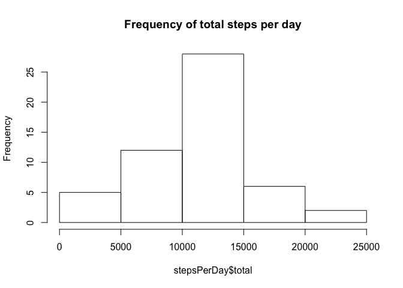
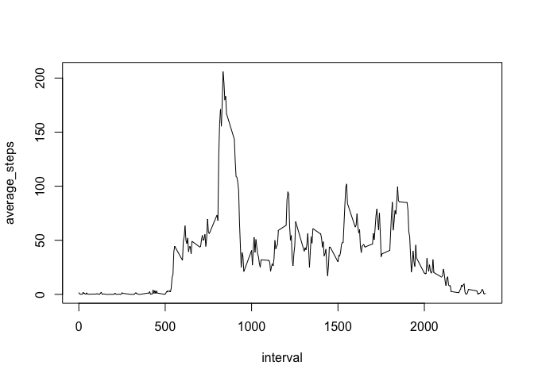
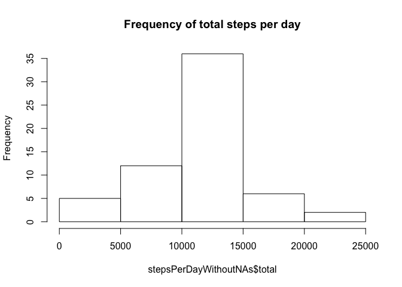
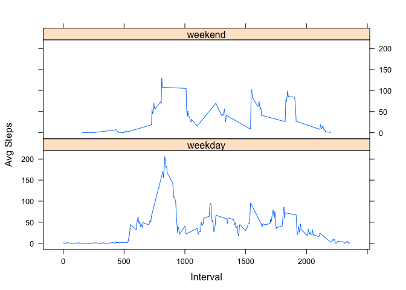

```r
# Loading libraries used later
library(dplyr)
```

```
## 
## Attaching package: 'dplyr'
```

```
## The following objects are masked from 'package:stats':
## 
##     filter, lag
```

```
## The following objects are masked from 'package:base':
## 
##     intersect, setdiff, setequal, union
```

```r
library(lattice)
```

## Loading and preprocessing the data


```r
activity = read.csv("activity.csv")
```

## What is mean total number of steps taken per day?

```r
stepsPerDay = aggregate(activity$steps, by=list(activity$date), FUN = sum)
colnames(stepsPerDay) <- c("day", "total")
hist(stepsPerDay$total, main="Frequency of total steps per day")
```

<!-- -->

The *mean* number of steps per day is: 


```r
mean(stepsPerDay$total, na.rm = TRUE)
```

```
## [1] 10766.19
```

The *median* number of steps per day is:


```r
median(stepsPerDay$total, na.rm = TRUE)
```

```
## [1] 10765
```

## What is the average daily activity pattern?


```r
avgStepsPerInterval = aggregate(activity$steps, by = list(activity$interval), FUN = mean, na.rm = TRUE)
colnames(avgStepsPerInterval) = c("interval", "average_steps")
plot(avgStepsPerInterval, type = "l")
```

<!-- -->

The 5-minute interval with the maximum number of steps is:


```r
avgStepsPerInterval[order(-avgStepsPerInterval$average_steps),]$interval[1]
```

```
## [1] 835
```

## Imputing missing values

The number of rows with missing values is:


```r
sum(is.na(activity$steps))
```

```
## [1] 2304
```

To impute missing values (NAs), we will replace them with the average of the same time interval:


```r
activityWithoutNAs = merge(activity, avgStepsPerInterval, by.x = "interval", by.y = "interval")
activityWithoutNAs$steps <- as.double(activityWithoutNAs$steps)
activityWithoutNAs$steps = coalesce(activityWithoutNAs$steps, activityWithoutNAs$average_steps)
activityWithoutNAs$average_steps <- NULL

stepsPerDayWithoutNAs = aggregate(activityWithoutNAs$steps, by=list(activityWithoutNAs$date), FUN = sum)
colnames(stepsPerDayWithoutNAs) <- c("day", "total")
hist(stepsPerDayWithoutNAs$total, main="Frequency of total steps per day")
```

<!-- -->

The *mean* number of steps per day is: 


```r
mean(stepsPerDayWithoutNAs$total)
```

```
## [1] 10766.19
```

The *median* number of steps per day is:


```r
median(stepsPerDayWithoutNAs$total)
```

```
## [1] 10766.19
```

By imputing missing values, the mean has remained the same, and the median has changed to match the mean.


## Are there differences in activity patterns between weekdays and weekends?


```r
weekends <- c("Saturday", "Sunday")
activityWithoutNAs$day <- ifelse(weekdays(as.POSIXct(activity$date)) 
                                 %in% c("Saturday", "Sunday"), "weekend", "weekday")
stepsPerInterval = aggregate(activityWithoutNAs$steps, by=list(activityWithoutNAs$interval, activityWithoutNAs$day), FUN = mean)
colnames(stepsPerInterval) <- c("interval", "day", "avg")

xyplot(avg ~ interval | day, stepsPerInterval, type = "l", layout = c(1, 2), 
    xlab = "Interval", ylab = "Avg Steps")
```

<!-- -->

From this plot we can see that weekends show more consistent activity throughout the day, whereas on weekdays there is a distinct peak in average steps during mornings.
